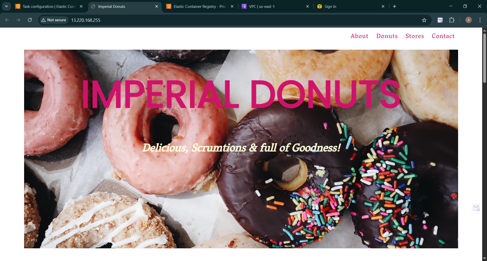

# 🚀 Push, Preview, Perfect: My Journey to Building On-Demand Preview Environments with GitHub Actions, Terraform & AWS

## 🛠 Introduction: Why I Built Ephemera-PreviewPilot

Have you ever needed to test a new feature or pull request (PR), only to find yourself manually cloning the repo, spinning up the environment, and sending screenshots or localhost links for feedback?

Yeah, same here.

That manual loop was painful and slow—especially when explaining the same changes repeatedly to teammates who couldn’t easily visualize them.

So, I thought:
> 💡 “What if we had a live preview link automatically created for every pull request?”

That's why I built **Ephemera-PreviewPilot** — a lightweight, automated system that spins up **live preview environments** for every GitHub PR. Anyone can test changes in a real cloud environment **before** merging.

---

## 🎯 What's the Goal?

The mission behind Ephemera-PreviewPilot is to:

- ✅ **Automate** previews for every pull request.
- ✅ Ensure **reliable environments** that reflect real deployments.
- ✅ Be **beginner-friendly**, so even newcomers to DevOps or CI/CD can follow along.

Whether you're a solo developer or part of a team, **preview environments supercharge feedback loops**, reduce bugs, and speed up development.

---

## ❓ What Is Ephemera-PreviewPilot?

A GitHub-Pull-Request-triggered CI/CD workflow that:

- 💻 Deploys your app to **AWS ECS Fargate**
- 🌐 Assigns a **public IP address** for live preview
- 🧹 **Destroys** the preview when the PR is closed or merged

No complex DNS configs or custom domains—just open your browser and paste the IP.

---

## 🔧 What It Does

- 🚀 Automatically deploys a fresh app environment for each PR
- 🧪 Lets anyone on your team test and interact with the live changes
- 🔒 Keeps production safe by isolating environments
- 💰 Cleans up infrastructure post-merge to save costs

---

## 🛠 Tech Stack & Tools

| Tool            | Purpose                                                                 |
|-----------------|-------------------------------------------------------------------------|
| **GitHub Actions** | Automates the CI/CD pipeline on PR open/close                        |
| **Terraform**       | Infrastructure-as-Code to manage AWS services                        |
| **Docker**          | Containerizes the app for consistent behavior across environments    |
| **AWS ECS (Fargate)** | Serverless container hosting for on-demand previews                 |
| **AWS S3**          | Stores Terraform state files                                          |
| **AWS DynamoDB**    | Locks Terraform state to prevent race conditions                     |
| **Bash Scripts**    | Simplifies setup and automation for infrastructure and environment   |

---

## 📁 Project Structure

```
 Ephemera-PreviewPilot/
├── .github/
│ └── workflows/
│ └── preview.yml # GitHub Actions workflow for PR automation
│
├── terraform/ # Infrastructure setup using Terraform
│ ├── main.tf
│ ├── variables.tf
│ └── outputs.tf
│
├── docker/ # Dockerized application
│ ├── Dockerfile
│ └── src/ # Your app's source code
│
├── S3_bucket.sh # Script to set up S3 and DynamoDB backend
``` 

---

## ⚙️ Getting Started

### ✅ Prerequisites

Ensure the following tools are installed and configured:

- [Git](https://git-scm.com/)
- [Docker](https://www.docker.com/)
- [Terraform](https://developer.hashicorp.com/terraform/downloads)
- [AWS CLI](https://docs.aws.amazon.com/cli/latest/userguide/install-cliv2.html) (with configured credentials)
- [Node.js](https://nodejs.org/)
- An [AWS Account](https://aws.amazon.com/free/)

---


---

## 🔐 Add GitHub Secrets

Before running the preview deployment workflow, you must set up your **AWS credentials** securely in GitHub:

1. Go to your repository on GitHub.
2. Click **Settings** → **Secrets and variables** → **Actions**.
3. Click **New repository secret** and add the following:

   | Name               | Value                                      |
   |--------------------|--------------------------------------------|
   | `AWS_ACCESS_KEY_ID`     | Your AWS IAM access key ID              |
   | `AWS_SECRET_ACCESS_KEY` | Your AWS IAM secret access key          |
   | `AWS_REGION`            | AWS region you are deploying to (e.g. `us-east-1`) |

These secrets are automatically injected into the GitHub Actions environment and used by the workflow to run `terraform`, `aws`, and `docker` commands securely.

> 💡 Make sure the IAM user has the right permissions to provision and manage ECS, ECR, VPC, IAM, and S3 resources.

---


### 📥 Clone the Repository

```bash
git clone https://github.com/GfavourBraimah/Ephemera-PreviewPilot.git
cd Ephemera-PreviewPilot
```

# Ephemera-PreviewPilot

## 🪣 Configure the Terraform Backend

Open and edit the S3 bucket name:
```bash
nano S3_bucket.sh
```

Run the script to provision the backend:
```bash
./S3_bucket.sh
```

Modify terraform/backend.tf with your bucket and region:
```hcl
terraform {
  backend "s3" {
    bucket = "your-unique-s3-bucket-name"
    key    = "terraform.tfstate"
    region = "your-region"     # e.g., us-east-1
    encrypt = true
  }
}
```

## 🐳 Add Your Application

Place your application source code in: `docker/src/`

Ensure your Dockerfile is configured to build from this folder.

## 🚀 Trigger the Preview

```bash
git checkout -b feature/my-preview-test
git add .
git commit -m "Add preview support"
git push origin feature/my-preview-test
```

Go to GitHub and open a Pull Request.


Watch the GitHub Actions workflow automatically deploy your app to AWS.


## 🌍 Access the Live Preview

### 🔍 Method 1: AWS Console (Recommended)

1. Go to the AWS Console
2. Navigate to ECS > Clusters
3. Select your cluster (e.g., preview-cluster)
4. Go to the Tasks tab → click the running task
5. Scroll to Networking → click the eni-xxxx link
6. On the EC2 Network Interface page, look for IPv4 Public IP
7. ✅ Paste the IP in your browser — your preview app is live!





## 🔁 Merge or Close the PR

Merge the PR when you're happy — the preview is auto-destroyed.

Close the PR if changes are not needed — the cleanup runs automatically.

🧹 This keeps your infrastructure tidy and your AWS bill low.


## 💬 Final Thoughts

Ephemera-PreviewPilot has helped me:

💡 Speed up feedback loops
🛡️ Reduce bugs before merging
🤝 Make collaboration with teammates smoother

I hope it inspires you to adopt or build your own preview environments.

## 📬 Let's Connect

Built by God'sfavour Braimah

Cloud Engineer | DevOps & DevSecOps Enthusiast | Automation Advocate

Feel free to fork, star ⭐, and contribute!